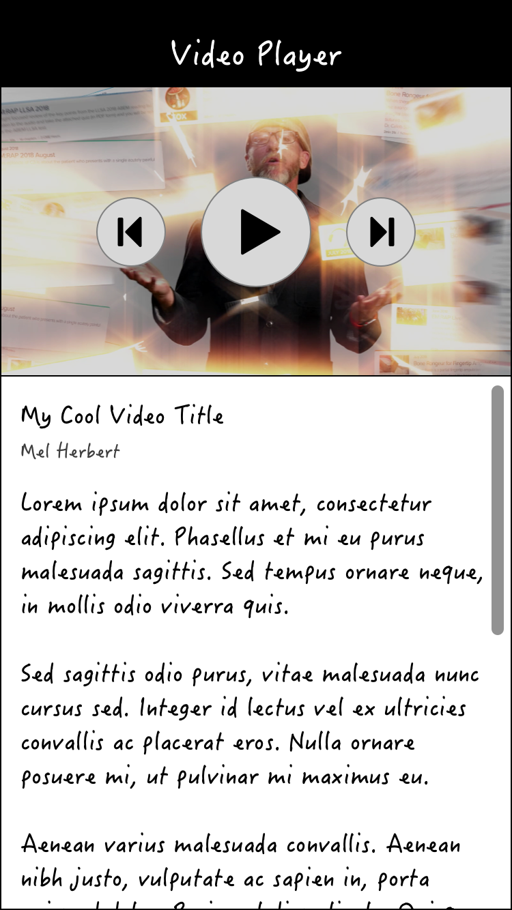

silverorange Native App Developer Assessment
============================================

This exercise is designed to assess how you approach tasks required in your
position as a native app developer at silverorange. We are interested to see
how you work as well, as what your final results are; include useful Git commit
messages and comments where you think your code may be unclear.

Wireframe
---------


Tasks
-----
Using one of either the blank Android **or** blank iOS project
in `/android` or `/ios`:

 1. Display a screen similar to the provided wireframe. The screen should
    contain a video player at the top and a scrollable details section at the
    bottom.
 2. Fetch a list of videos from the provided API (see instructions below for
    running the API).
 3. Sort the received list of videos by date.
 4. Load the first video into the UI by default.
 5. Implement the play/pause button for the video player. The app should be
    paused on startup.
 6. Implement next/previous buttons for the video player. Clicking next should
    update the UI with the next video and video details. Buttons should be
    insensitive when at the start/end of the list.
 7. In the details section, show the returned description for the current video
    as rendered Markdown.
 8. In the details section, also display the title and author of the current
    video.
 9. Import and use the provided image assets for the media controls. For
    Android, use the provided SVG files. For iOS, use the provided PDF files.

Environment
-----------
For this project, you can use any one of:

 - Android + Java
 - Android + Kotlin
 - iOS + SwiftUI
 - iOS + Objective-C

There are blank projects created in the `android/` and `ios/` folders. Please
start with one of the blank projects using Android Studio or Xcode.

Dependencies
------------
For media playback, Markdown parsing and/or networking you may want to use
external dependencies. For Android, please use Gradle dependencies. For iOS,
please use CocoaPods.

You may consider using these packages, but are not required to use them:

iOS:
 - https://cocoapods.org/pods/MarkdownKit (Markdown)
 - https://cocoapods.org/pods/Down (Markdown)
 - https://cocoapods.org/pods/Alamofire (Networking)

Android: 
 - https://github.com/google/ExoPlayer#using-exoplayer (Media playback)
 - https://noties.io/Markwon/docs/v4/install.html (Markdown)
 - https://github.com/google/gson#download (JSON parsing)
 - https://square.github.io/okhttp/#releases (HTTP)
 - https://square.github.io/retrofit/#download (HTTP + parsing)

Commits
-------
Your commit history is important to us! Try to make meaningful commit messages
that show your progress.

Getting Started With the Server Backend (/server)
-----------------------------------------------
For this exercise a pre-built server application is provided. The application
runs by default on `localhost:4000` and has the following endpoints:

 - `http://localhost:4000/videos` - returns a JSON-encoded array of videos.

### Running the Server

The provided API server is needed as a data source for your project. To run
the server you will need NodeJS and Yarn. On macOS you can install the
requirements using Homebrew with:

```sh
brew install node yarn
```

With dependencies installed, you can run the server with:

```sh
cd server/
yarn install
yarn start
```

You can verify the API is working by visiting http://localhost:4000/videos in
your browser or another HTTP client.
